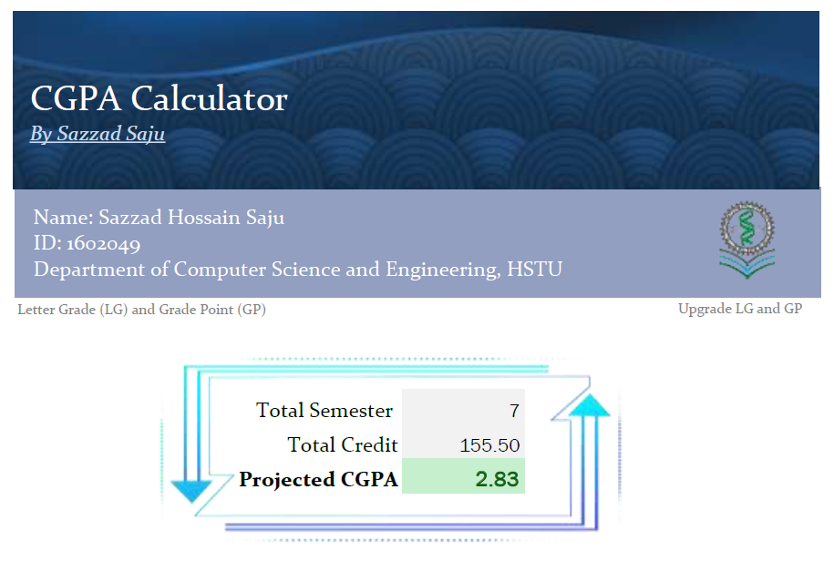
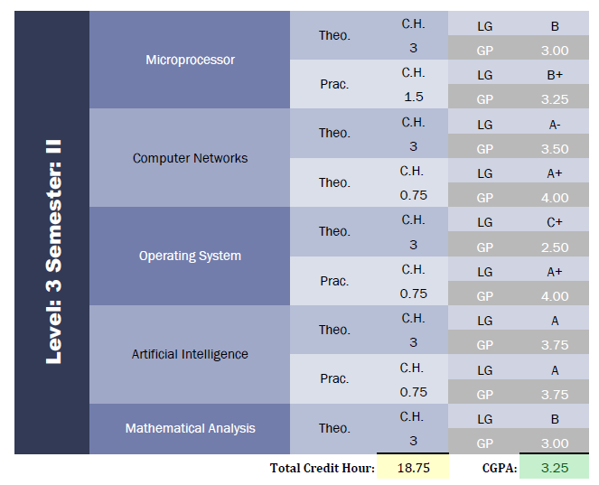

# Calculate-CGPA-in-Excel

* LG: Letter grade, GP: Grade Point
* Update LG and GP and
* Your Name, Id

  Designed for dept. of <b> CSE, HSTU </b>

# Screenshoots

  <!--    -->
    

            
:copyright:Sazzad-Saju 

 END OF DOCUMENT :smile:

